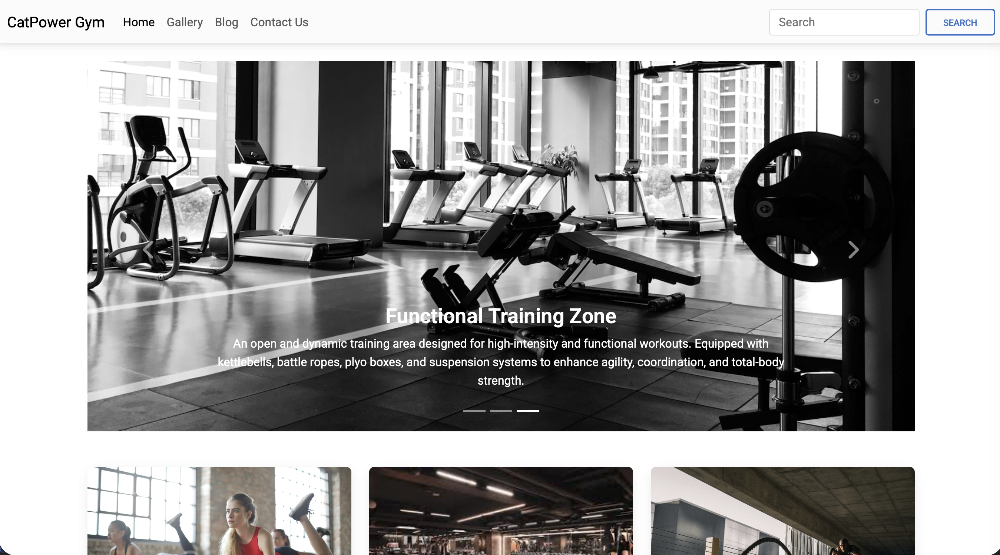
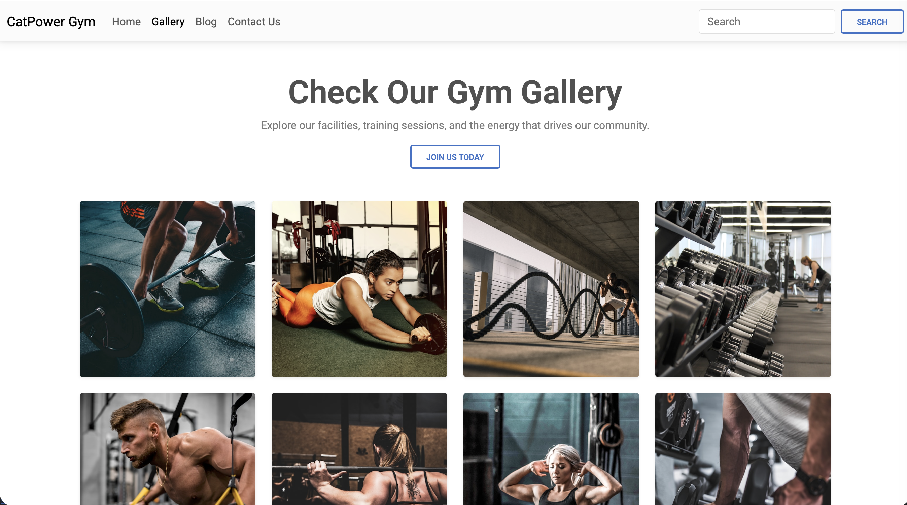
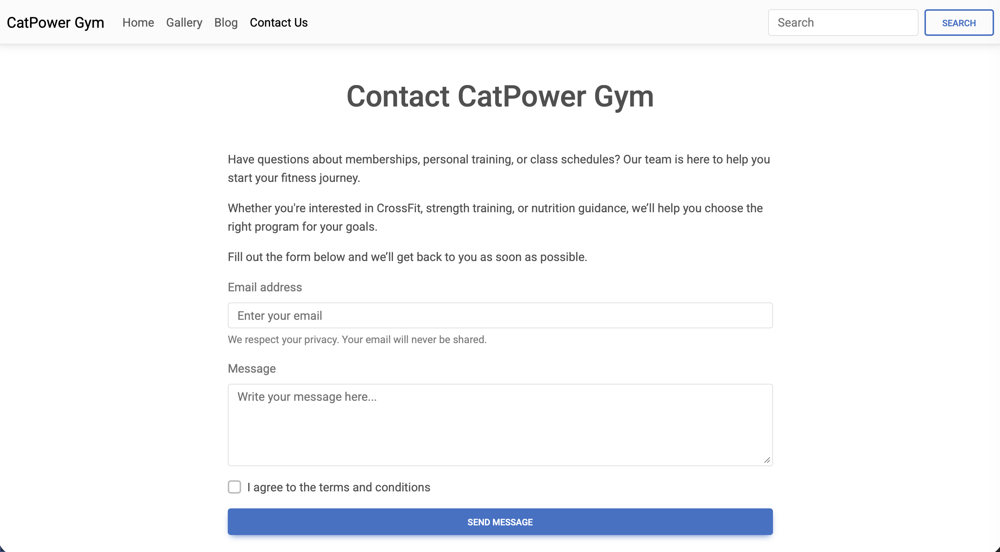

# 🏋️ CatPowerGym

[](https://catirato.github.io/CatPowerGym/)


**CatPowerGym** is a **responsive Angular web application** designed for a modern gym.  
The website showcases the gym’s **services, facilities, and contact information** through a clean and engaging user interface.

The application includes several sections such as a **dynamic homepage, image gallery, fitness blog, and contact page**, using **Angular reusable components and client-side routing** to provide a smooth browsing experience.

The project was designed as a **static web application suitable for deployment on GitHub Pages**.

---

# 🌐 Live Demo

🔗 **View the website:**  
https://catirato.github.io/CatPowerGym/

---

# 🖼️ Website Preview

<p align="center">
  
  
  
  
</p>

---

# ✨ Features

- 🏠 Dynamic homepage presenting the gym
- 🖼 Image gallery showcasing facilities
- 📝 Fitness blog section
- 📞 Contact page with gym information
- 🔀 Client-side routing with Angular Router
- 🧩 Reusable Angular components
- 📱 Fully responsive layout
- ⚡ Static site deployment compatible with GitHub Pages

---

# 🛠 Tech Stack

| Technology | Purpose |
|------------|--------|
| **Angular** | Frontend framework |
| **TypeScript** | Application logic |
| **HTML5** | Page structure |
| **CSS3** | Styling and responsive design |
| **Angular Router** | Navigation between pages |

---

# 📂 Project Structure

```
CatPowerGym/
│
├── src/
│   ├── app/
│   │   ├── components/
│   │   ├── pages/
│   │   ├── services/
│   │   └── app-routing.module.ts
│   │
│   ├── assets/
│   └── styles/
│
└── README.md
```

---

# 🚀 Running the Project

### Install dependencies

```bash
npm install
```

### Run the development server

```bash
ng serve
```

Then open:

```
http://localhost:4200
```

---

# 👩‍💻 Author

**Catarina Rato**

Front-end project developed to explore **Angular components, routing, and responsive interface design**.
